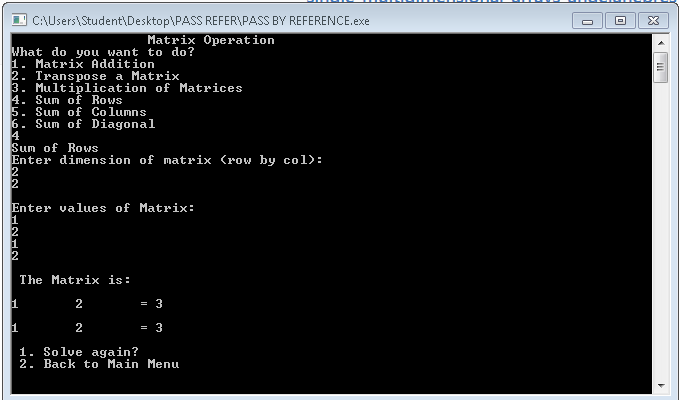
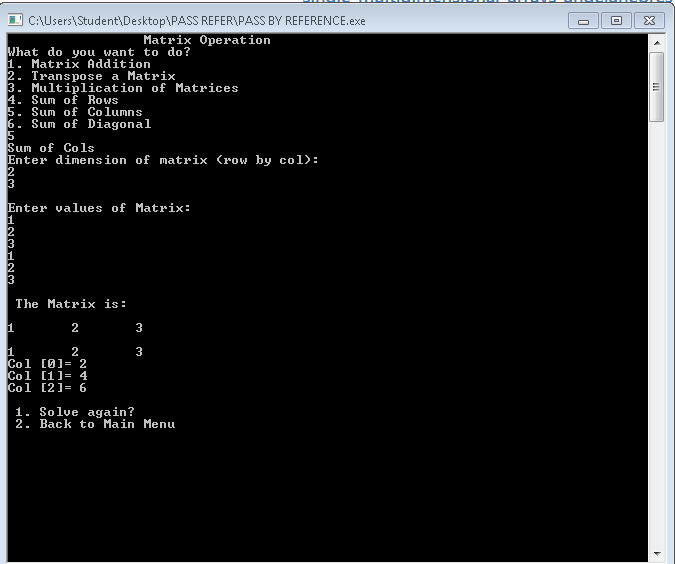
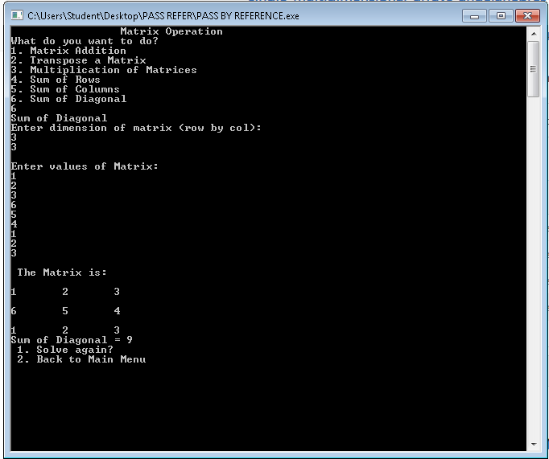
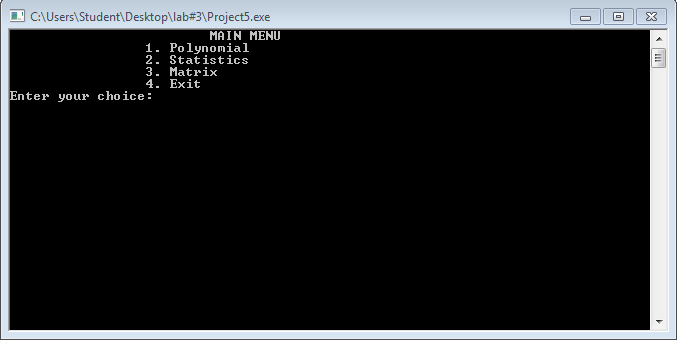
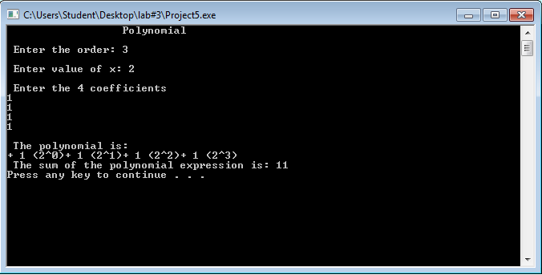
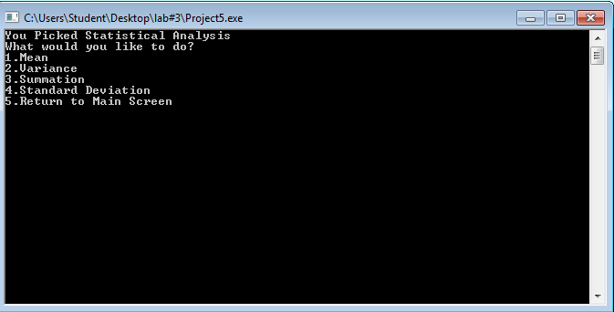
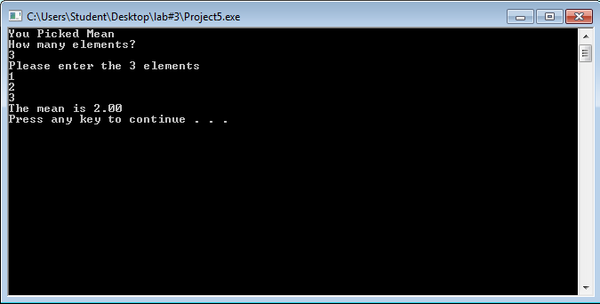

# lbyec72-ej1-p3-single_multidimensional_arrays-angelanebres
lbyec72-ej1-p3-single_multidimensional_arrays-angelanebres created by GitHub Classroom

JULY 26, 2016
Additional Features: Sum of Rows, Sum of Columns, Sum of Diagonal

June 21, 2016
I have made the main menu, and the statistical analysis menu. The screen for polynomials is also included.

It can print out the correct polynomial but does not correctly indicate the sum. It goes back to the main menu afterwards

Statistical Analysis: can only compute for the mean

